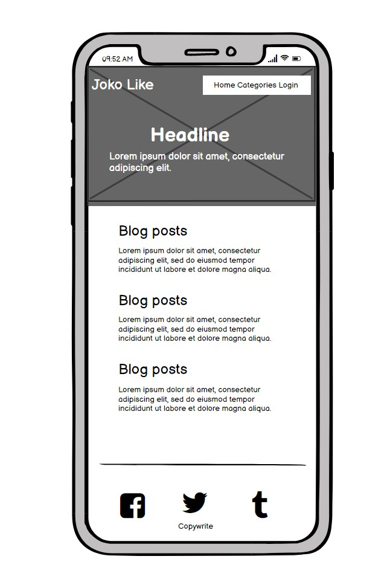
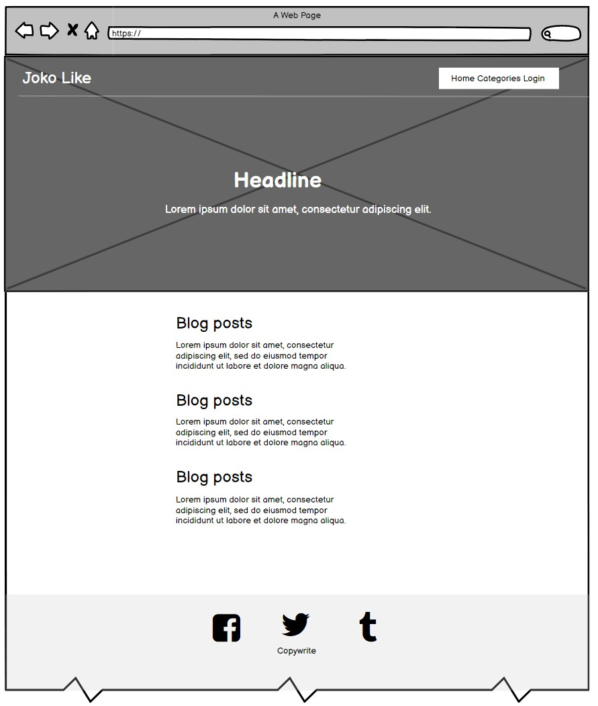
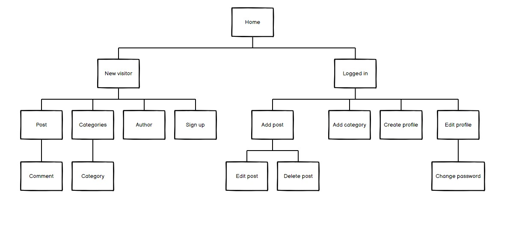
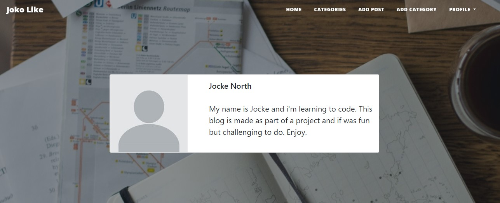
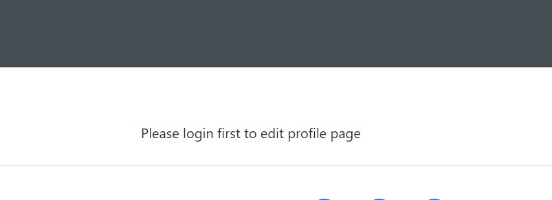
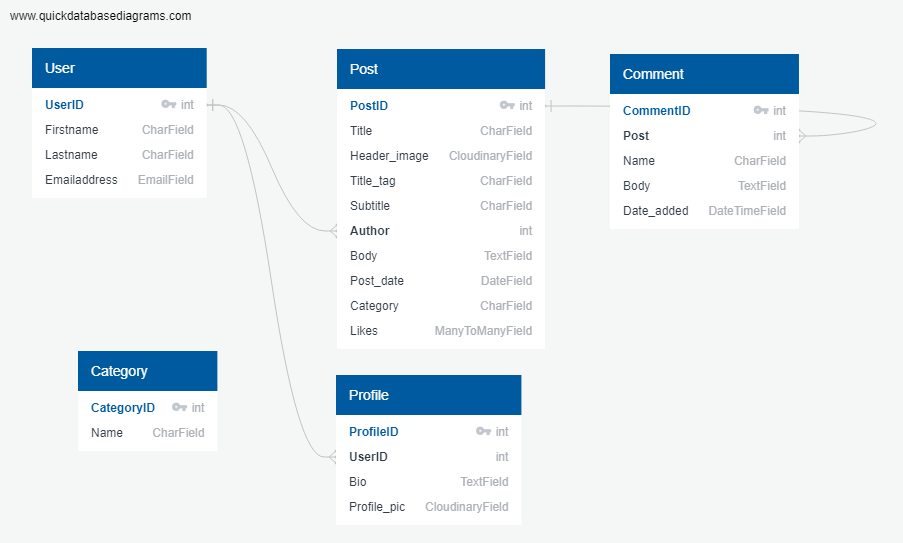

<h1 align="center">Joko Like</h1>

[View the live project here.](https://joko-like.herokuapp.com/)

This is a simple blog made for copywriters and content creator to easily create articles and add them to categories. All articles have a comment section for visitor to engage with the author for each article.

# Table of contents

1. [Planning Stage](#Planning-Stage)
    * [Project Goals](#Project-Goals)
    * [Wireframes](#Wireframes)
    * [User Stories](#User-Stories)
    * [Design](#Design)
    * [Features](#Features)
    * [Features to be added](#Features-to-be-added)
2. [Technologies Used](#Technologies-Used)
    * [Languages Used](#Languages-Used)
    * [Frameworks, Libraries & Programs Used](#frameworks-libraries--programs-used)
3. [Testing](#Testing)
    * [Validators](#Validators)
    * [Manual Testing](#Manual-Testing)
    * [Known Bugs](#Known-Bugs)         
4. [Deployment](#Deployment)
    * [Repository Creation](#Repository-creation) 
    * [Deployment Steps](#Deployment-Steps)
    * [Add Heroku Postgres Database](#Add-Heroku-Postgres-Database)
    * [Connecting to heroku](#Connecting-to-heroku)
    * [Connect Heroku app to Github repository](#Connect-Heroku-app-to-Github-repository)
    * [Config Var](#Config-var)
    * [Making a clone to run locally](#Making-a-clone-to-run-locally)
    * [How to Fork the respository](#How-to-Fork-the-Respository)
5. [Credits](#Credits)
    * [Content](#Content)
    * [Code](#Code)
    * [Acknowledgements](#Acknowledgements)

---

# Planning Stage

## Project Goals

The main goal for this project is to create an easy platform for content creators to add blog post about nothing and anything.

Blog readers can engage in a dialog with other fans through the comment section.

As a site admin/User you can manage all posts and comments and easily add new posts and edit/delete old ones.

## User Stories

**[View kanban here](https://github.com/users/joachimnorden/projects/2)**

**First time and Recurring Stories**
- As a Site Visitor, I want to be able to Browse through posts so that I can see all available articles.
- As a Site Visitor, I want to be able to Read a post so that I can see its entirety.
- As a Site Visitor, I can view the number of likes on each post so that I can see which is the most popular
- As a Site Visitor, I can view comments on a post so that I can read the conversation
- As a Site Visitor, I want to be able to Filter posts through categories.
- As a Site Visitor, I want to be able to Like and unlike a post.
- As a Site Visitor, I want to be able to Post Comments.
- As a Site Visitor, I want to be able to Register for an account.
- As a Site Visitor, I want to be able to Read more about the author.

**Site User/Admin**
- As a Site User, I want to be able to Change password.
- As a Site User, I want to be able to Post Stories to the site.
- As a Site User, I want to be able to Like and Unlike posts.
- As a Site User, I want to be able to Edit published posts.
- As a Site User, I want to be able to Delete published posts.

## Wireframes

-   Mobile
    <h2 align="left"></h2>

-   Desktop
    <h2 align="left"></h2>

-   Sitemap
    <h2 align="left"></h2>

# Design

## Design choice
Bootstrap provides a flexible framework for building upon and wherever possible its structure has been used and modified to achieve the desired functionality and feel.
Simple, simple and simple to keep it uncluttered. 
Using a big hero to set the mood and theme for the articles. 
Using Bootstraps native font-stack that selects the best font-family for each OS and device.

## Color schema

The color scheme is black and white. This is to keep the text in the focus.

## Features

-   A clean and simple navigation that doesn't take too much attention away from the content. If you start scrolling up the menu will appear
    <h2 align="left"></h2>

-   A list of all the articles with links to the full article, the author and the category

-   A comment, author and like section on each article

-   An author profile page with a profile picture and bio
    <h2 align="left"></h2>

-   A sign up form to be able to login and create posts and categories

-   Ability to change password, change profile bio, edit and delete posts

-   Social media links are added to the footer

-   Made sure that visitors not authorized to edit/delete stuff get's a warning message.
    <h2 align="left"></h2>

## Features to be added

-   Pagination to the list of posts

-   Approve posts before publishing 

-   Use bootstrap on all forms and add more form validation

[Go to top](#Table-of-contents)

# Structure

Simplicity helps users to quickly and easily access the app and navigate within the app.

The website is made from 2 apps:

- Blog
- Members

## Database schema

# Technologies Used

## Languages Used

-   [HTML5](https://en.wikipedia.org/wiki/HTML5)

-   [CSS](https://en.wikipedia.org/wiki/Cascading_Style_Sheets)

-   [JavaScript](https://www.javascript.com/)

-   [PYTHON](https://www.python.org/)
        The following Python modules were used on this project:
            asgiref==3.5.2
            cloudinary==1.29.0
            dj-database-url==0.5.0
            dj3-cloudinary-storage==0.0.6
            Django==3.2.13
            django-ckeditor==6.4.2
            django-js-asset==2.0.0
            django-summernote==0.8.20.0
            gunicorn==20.1.0
            psycopg2==2.9.3
            pytz==2022.1
            sqlparse==0.4.2

## Frameworks, Libraries & Programs Used

1. [Git](https://git-scm.com/)

    - Git was used for version control by utilizing the Gitpod terminal to commit to Git and Push to GitHub.

2. [GitHub:](https://github.com/)

    - GitHub is used to store the projects code after being pushed from Git.

3. [Django](https://www.djangoproject.com/)

    - Django provided me with a easy to use Python framework

4. [Heroku](https://www.heroku.com/)

    - Heroku was used to host the project.  

5. [Summernote](https://summernote.org/)

    - Summernote is used to add a RichTextEditor to the articles.

6. [Google Fonts](https://fonts.google.com/)

    - Google fonts is used to import fonts.

7. [Balsamiq](https://balsamiq.com/)

    - Balsamiq was used to create wireframes during the design process.

8. [Cloudinary](https://cloudinary.com/)

    - Cloudinary is used for storing static files online.

9. [Bootstrap](https://getbootstrap.com/)

    - Bootstrap is used as a front-end framework throughout the site.

[Go to top](#Table-of-contents)

# Testing

Testing and results can be found [here](TESTING.md).

# Deployment

This project was developed using [Gitpod IDE](https://gitpod.io) and pushed to Github using the in-built terminal. However, because Github can only host static websites it was necessary to deploy this project to Heroku because it is a compatible hosting platform for a back-end focused site like Trainees Portal.

This project was deployed using Heroku and stored in GitHub.

## Repository Creation

1. Navigate to [Github](https://github.com/).
2. Create a new repository by first clicking the green button labeled new on the top left of the screen.
3. Select the [Code Institute Full Template](https://github.com/Code-Institute-Org/gitpod-full-template) in the templates section.
4. Give the repository a name, in this case Trainees Portal.
5. Click the green 'Create Repository' button at the bottom of the page.
6. Inside the repository click the green 'gitpod' button to initialize your repository.
8. Future access to this workspace must be gained through gitpod workspaces, clicking the green button in gitpod again 
will initialize a new workspace.
9. Use the `git add .` command to add all modified and new files to the staging area.
10. Use the `git commit -m` command to commit a change to the local repository.
11. Use the `git push` command to push all committed changes to github.   

Before deploying the website to Heroku, the following five must be followed to allow the app to work in Heroku:

1.  Install `django-gunicorn`, `psycopg2` and `dj_database_url`, `cloudinary` in your workspace cli.

2. Create requirements.txt file that contains the names of packages being used in Python. It is important to update this file if other packages or modules are installed during project development by using the following command:

    - pip freeze --local > requirements.txt

3. Create Procfile that contains the name of the application file so that Heroku knows what to run. If the Procfile has a blank line when it is created remove this as this may cause problems.

4. Create env.py that conrtains all secret variables as DATABASE_URL, SECRET_KEY and CLOUDINARY_URL, this file is hidden.

5. Push these files to GitHub.

[Go to top](#introduction)

## Deployment Steps

The project was developed using [GitPod](https://gitpod.io/) and pushed to [GitHub](https://github.com/).

Once the above steps are done, the website can be deployed in Heroku using the steps listed below:

1. Log into Heroku .
2. Click the New button.
3. Click the option to create a new app.
4. Enter the app name in lowercase letters.
5. Select the correct geographical region.
6. Click to create

## Add Heroku Postgres Database

1. Click the resources tab in heroku.
2. Under Add-ons search for heroku postgres.
3. Click on heroku postgres when it appears. 
4. Select the Hobby Dev-Free option in plans. 
5. Click submit order form.

## Connecting to Heroku

1. Create a requirements.txt file using command *pip3 freeze > requirements.txt*
2. Create a Procfile with the terminal command *web: gunicorn knit_happens.wsgi:application* and at this point checking the Procfile to make sure there is no extra blank line as this can cause issues when deploying to Heroku.
3. Use the loaddata command to load the fixtures for both json files: *python3 manage.py loaddata categories.json* and *python3 manage.py loaddata products.json*
4. If it returns error message: *django.db.utils.OperationalError: FATAL: role <somerandomletters> does not exist* run *unset PGHOSTADDR* in your terminal and run the commands in step 11 again.
5. From the CLI log in to Heroku using command *heroku login -i*.
6. Temporarily disable Collectstatic by running: *heroku:config:set DISABLE_COLLECTSTATIC=1 --app <heroku-app-name>* So that Heroku won't try to collect static files when we deploy.
7. Add Heroku app name to ALLOWED_HOSTS in settings.py.
8. Commit changes to GitHub using *git add .*, *git commit -m <commit message>*, *git push*.
9. Then deploy to Heroku using *git push heroku main*
If the git remote isn't initialised you may have to do that first by running *heroku git:remote -a <heroku-app-name>
10. Create a superuser using command: *heroku run python3 manage.py createsuperuser* so that you can log in to admin as required.
11. From Heroku dashboard click "Deploy" -> "Deployment Method" and select "GitHub"
12. Search for your GitHub repo and connect then Enable Automatic Deploys.
13. Generate secret key. Strong secret keys can be obtained from [MiniWebTool](https://miniwebtool.com/django-secret-key-generator/). This automatically generates a secret key 50 characters long with alphanumeric characters and symbols. 
14. Add secret key to GitPod variables and Heroku config vars.
15. Set up Amazon AWS S3 bucket using instructions [below](#amazon-aws)
16. In the dashboard click "Settings" -> "Reveal Config Vars"
17. Set [config vars](#config-vars) using advice below.

## Connect Heroku app to Github repository

1. In heroku select the deploy tab.
2. Click github button.
3. Enter the repository name and click search.
4. Select the relevant repository and click connect
5. Select Main branch
6. Click on deploy branch 

## Config Vars

The config/environment variables should be set up as follows:

| Key                    | Value                      |
| ---------------------- |--------------------------- |
| PORT                   | 8000                       |
| CLOUDINARY_URL         | YOUR_CLOUDINARY_KEY        |
| SECRET_KEY             | YOUR_SECRET_KEY            |
| DATABASE_URL           | YOUR_POSTGRES_URL          |

## Making a clone to run locally

It is important to note that this project will not run locally unless an env.py file has been set up by the user which contains the DATABASE_URL, SECRET_KEY and CLOUDINARY_URL which have all been kept secret in keeping with best security practices. 

1. Log into GitHub.
2. Select the [respository](https://github.com/Georgette-Lumbe/stay_fit).
3. Click the Code dropdown button next to the green Gitpod button.
4. Download ZIP file and unpackage locally and open with IDE. Alternatively copy the URL in the HTTPS box.
5. Open the alternative editor and terminal window.
6. Type 'git clone' and paste the copied URL.
7. Press Enter. A local clone will be created.

Once the project been loaded into the IDE it is necessary to install the necessary requirements which can be done by typing the following command.

    -pip install -r requirements.txt

## How to Fork the respository.

1. Log into GitHub.
2. In Github go to the [respository](https://github.com/Georgette-Lumbe/stay_fit).
3. In the top right hand corner click "Fork".

---

[Go to top](#Table-of-contents)

# Credits

## Content

-   All the images is from [pexels](https://www.pexels.com/)

-   All the articles is from [amazines](https://www.amazines.com/Archive/index.cfm)

## Code

-   Used a bootstrap template for the initial design [startbootstrap](https://startbootstrap.com/theme/clean-blog)

-   The inspiration for the script making navbar appear on scroll up [codepen](https://codepen.io/philipbenton/pen/DbREyB)

-   A good support throughout the entire code project [YouTube](https://www.youtube.com/watch?v=nWBgg2QXtSA&list=PLXcnmXd-db_hO1v3SLAzVcNieoS_Tcn-6&index=4&ab_channel=Codemy.com)

-   Inspiration for the project from the "I Think Therefore I Blog" tutorial form [Code Institute](https://codeinstitute.net/se/)

-   Bootstrap documentation [Bootstrap docs](https://getbootstrap.com/docs/5.2/getting-started/introduction/)

-   Summernote documentation [Summernote docs](https://summernote.org/getting-started/)

-   Various stackoverflow posts [Stackoverflow](https://stackoverflow.com/)

## Acknowledgements

-   My Partner for supporting me.

-   Tutor support at Code Institute for their support.

-   Code Institue slack forum

[Go to top](#Table-of-contents)
