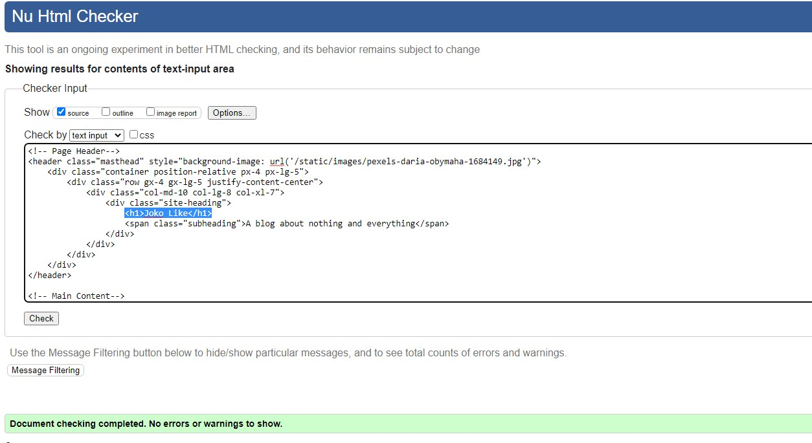
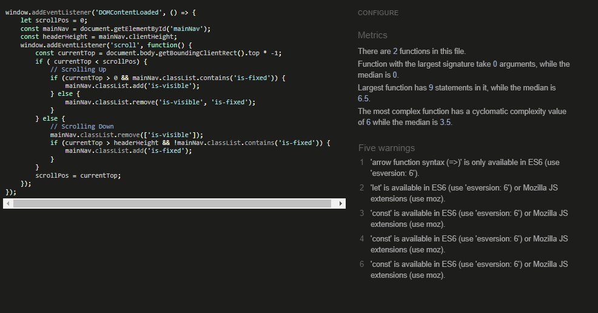

[Validators](#validators)
* [Lighthouse](#lighthouse)
* [HTML](#html)
* [CSS](#css)
* [JSHINT](#jshint)
* [PEP8](#pep8)

[User Stories Testing](#user-stories-testing)

[Responsiveness](#responsiveness)

[Bugs](#bugs)

# Lighthouse 

# HTML

- All Pages were checked with the official [W3C validator](https://validator.w3.org/). 

## Home Page

## Blog Post

## Categories

## Profile Page

## Edit Profile Page

## Category Page

## Add Post Page

Unsolved bugs! A lot of errors related to the form. Due to lack of time if remains unsolved.

# CSS

## style.css

# JSHINT 
- All JS was passed through Jshint

## script.js

# PEP8
 - PEP8 only shows the type of errors that can be ignored.

 

# User Stories Testing

## EPIC: First time and Recurring Stories
1. As a Site Visitor, I want to be able to Browse through posts so that I can see all available articles.
    -  As soon as you land on the startpage you'll see all available posts

2. As a Site Visitor, I want to be able to Read a post so that I can see its entirety.
    - Clicking on the title of a post redirects you to the complete post

3. As a Site Visitor, I can view the number of likes on each post so that I can see which is the most popular
    - On the Post page you can see the number of likes

4. As a Site Visitor, I can view comments on a post so that I can read the conversation
    - On the Post page you can see all the comments for a specific post

5. As a Site Visitor, I want to be able to Filter posts through categories.
    - In the menu all available categories are listed and each category lists all posts tagged with that category

6. As a Site Visitor, I want to be able to Register for an account.
    - A Site Visitor can see a sing up link in the navigation

7. As a Site Visitor, I want to be able to Read more about the author.
    - A Site Visitor can click on the author of the post from the startpage or on the post itself to read more aboute the author

8. As a Site Visitor, I want to be able to Post Comments.
    - After reading a Post a Site Visitor can choose to add a comment in the bottom of the page

## EPIC: Site User/Admin

9. As a Site User, I want to be able to Change password.
    - You can reset password on the log in page and change password on the Edit Settings page

10. As a Site User, I want to be able to Post Stories to the site.
    - When logged in and after creating a profile a Site User can create a Post
    
11. As a Site User, I want to be able to Like and Unlike posts.
    - When logged in and reading a post a Site User can Like and Unlike posts

12. As a Site User, I want to be able to Edit published posts.
    - A Site User can edit their own post when on the post page

13. As a Site User, I want to be able to Delete published posts.
    - A Site User can delete their own post when on the post page

# Responsivness
The page is fully responsive and all user stories works in both mobile and desktop

## Known Bugs

- On Add post and Edit post page the CKEditor for adding a Rich Text Editor didn't work
	- Fixed by changing CKEditor to Summernote instead

- As an admin I couldn't save a Post without picking a Like.
	- Fixed by setting blank=True on the model.

- Category-pages doesn't work if a category starts with a capital letter.

- Didn't have the time to create an edit and delete category page